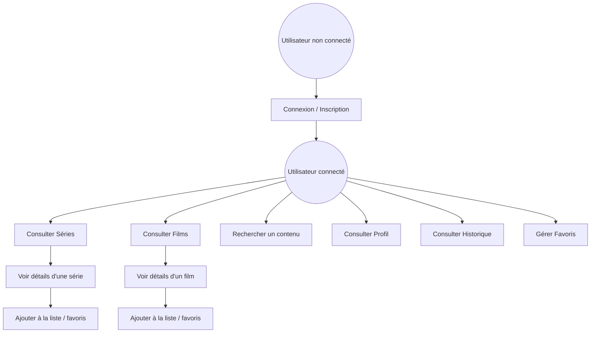
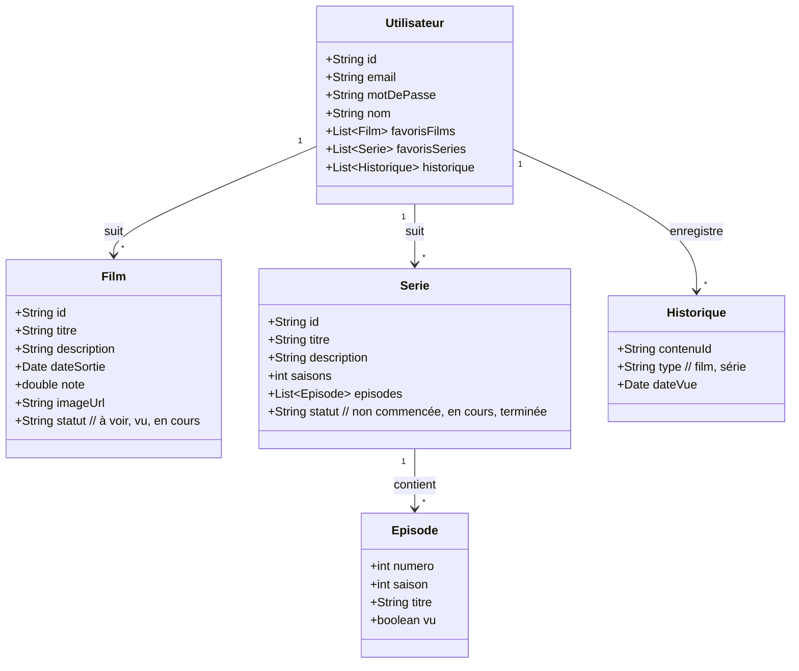
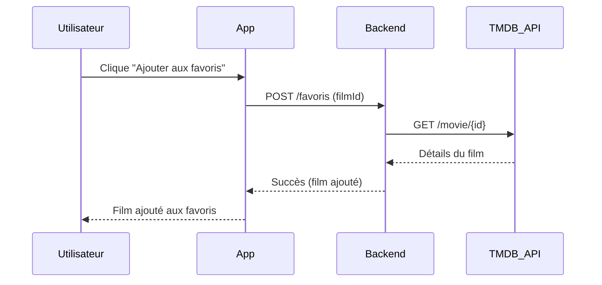
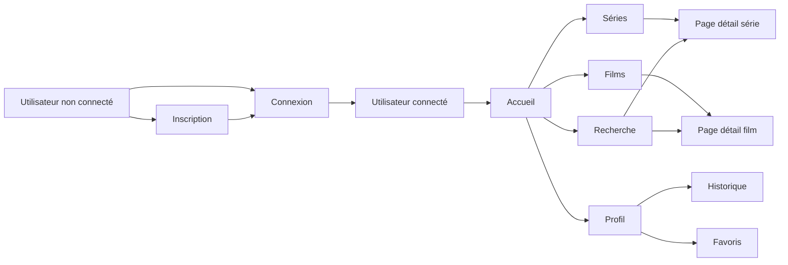

# 📱 Application Visu – Schémas UML

---

## 1. Diagramme de cas d’utilisation

## 2. Diagramme de classes

## 3. Diagramme de séquence : ajout d’un film aux favoris

## 4. Diagramme de navigation des pages

