# 📱 Application Visu – Schémas UML

---

## 1. Diagramme de cas d’utilisation

```mermaid
graph TD
    User((Utilisateur non connecté)) --> Connexion[Connexion / Inscription]

    Connexion --> UtilisateurConnecté((Utilisateur connecté))

    UtilisateurConnecté --> VoirSéries[Consulter Séries]
    UtilisateurConnecté --> VoirFilms[Consulter Films]
    UtilisateurConnecté --> Recherche[Rechercher un contenu]
    UtilisateurConnecté --> Profil[Consulter Profil]
    UtilisateurConnecté --> Historique[Consulter Historique]
    UtilisateurConnecté --> Favoris[Gérer Favoris]

    VoirSéries --> DétailSérie[Voir détails d'une série]
    VoirFilms --> DétailFilm[Voir détails d'un film]
    DétailSérie --> AjouterSérie[Ajouter à la liste / favoris]
    DétailFilm --> AjouterFilm[Ajouter à la liste / favoris]

```

## 2. Diagramme de classes

```mermaid
classDiagram
    class Utilisateur {
        +String id
        +String email
        +String motDePasse
        +String nom
        +List~Film~ favorisFilms
        +List~Serie~ favorisSeries
        +List~Historique~ historique
    }

    class Film {
        +String id
        +String titre
        +String description
        +Date dateSortie
        +double note
        +String imageUrl
        +String statut // à voir, vu, en cours
    }

    class Serie {
        +String id
        +String titre
        +String description
        +int saisons
        +List~Episode~ episodes
        +String statut // non commencée, en cours, terminée
    }

    class Episode {
        +int numero
        +int saison
        +String titre
        +boolean vu
    }

    class Historique {
        +String contenuId
        +String type // film, série
        +Date dateVue
    }

    Utilisateur "1" --> "*" Film : suit
    Utilisateur "1" --> "*" Serie : suit
    Serie "1" --> "*" Episode : contient
    Utilisateur "1" --> "*" Historique : enregistre
```



## 3. Diagramme de séquence : ajout d’un film aux favoris

```mermaid
sequenceDiagram
    participant Utilisateur
    participant App
    participant Backend
    participant TMDB_API

    Utilisateur->>App: Clique "Ajouter aux favoris"
    App->>Backend: POST /favoris (filmId)
    Backend->>TMDB_API: GET /movie/{id}
    TMDB_API-->>Backend: Détails du film
    Backend-->>App: Succès (film ajouté)
    App-->>Utilisateur: Film ajouté aux favoris
```



## 4. Diagramme de navigation des pages

```mermaid
flowchart LR
    %% États
    NonConnecte[Utilisateur non connecté]
    Connecte[Utilisateur connecté]

    %% Pages pour utilisateur non connecté
    NonConnecte --> Connexion[Connexion]
    NonConnecte --> Inscription[Inscription]

    Inscription --> Connexion
    Connexion --> Connecte

    %% Pages accessibles après connexion
    Connecte --> Accueil
    Accueil --> Séries
    Accueil --> Films
    Accueil --> Recherche
    Accueil --> Profil

    Séries --> DétailSérie[Page détail série]
    Films --> DétailFilm[Page détail film]
    Recherche --> DétailSérie
    Recherche --> DétailFilm
    Profil --> Historique
    Profil --> Favoris

```